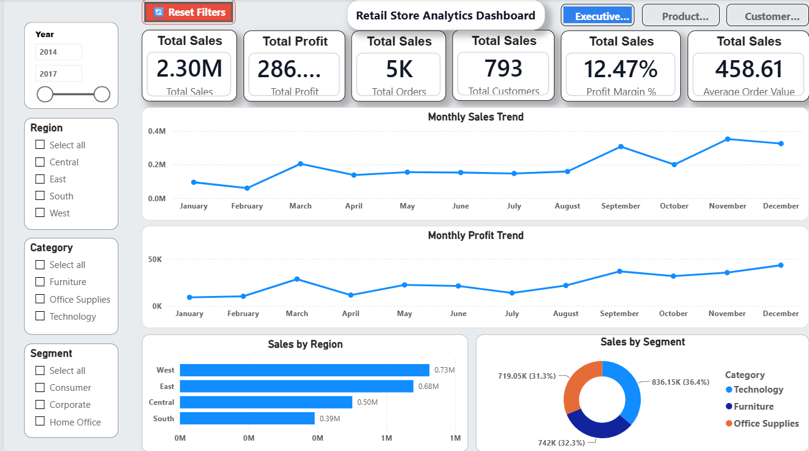
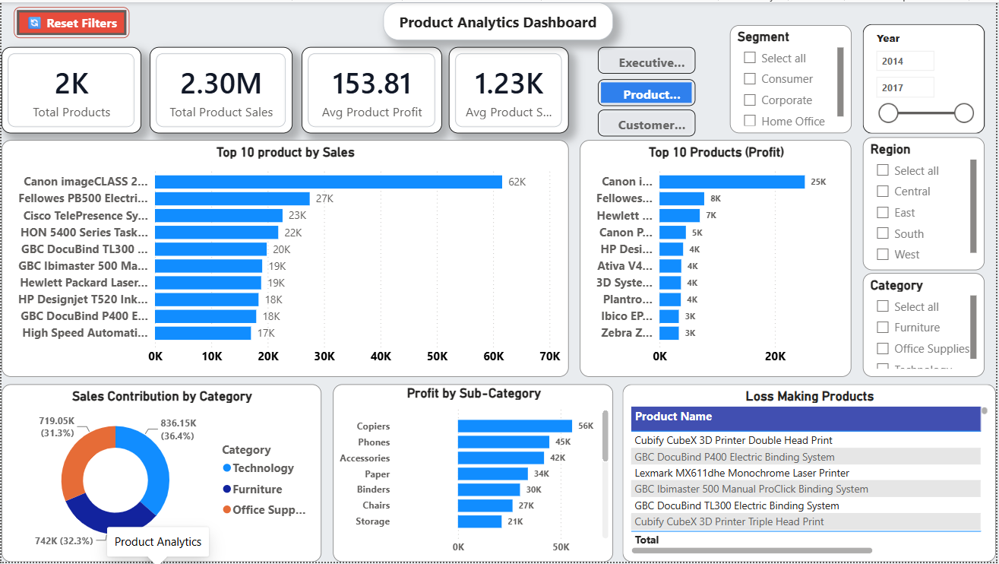
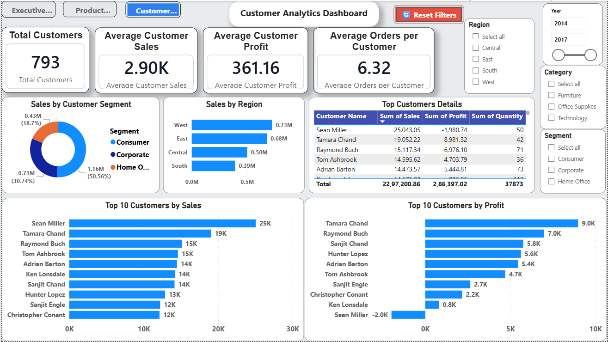

# Retail Store Analytics Dashboard

A complete end-to-end Retail Store Sales Analysis project built using **Python, SQL, Excel, and Microsoft Power BI**.

This project transforms raw retail sales data into meaningful business insights through data cleaning, exploratory data analysis (EDA), SQL analysis, and an interactive Power BI dashboard.

## Project Overview

Businesses generate thousands of sales records every day. Raw data alone does not provide valuable insights.

The objective of this project is to analyze retail sales data and answer important business questions such as:

- Which products generate the highest revenue?
- Which regions perform the best?
- Which customer segments contribute the most profit?
- How do discounts affect profitability?
- What trends can management use for better decision-making?

The final result is an interactive Power BI dashboard designed for business users.

## Project Highlights

- Performed data cleaning and preprocessing using Python (Pandas & NumPy).
- Conducted Exploratory Data Analysis (EDA) to identify trends and patterns.
- Built an interactive Power BI dashboard with multiple report pages.
- Created KPIs to monitor Sales, Profit, Orders, and Quantity.
- Analyzed customer behavior, regional performance, and product profitability.

# Technologies Used

| Tool | Purpose |
|------|----------|
| Python | Data Cleaning & EDA |
| Pandas | Data Manipulation |
| NumPy | Numerical Operations |
| Matplotlib | Data Visualization |
| Seaborn | Exploratory Charts |
| SQL | Data Querying |
| Excel | Initial Dataset |
| Power BI | Dashboard Development |
| Git | Version Control |
| GitHub | Portfolio Hosting |

# Dataset

**Dataset Name**

Retail Store Sales Dataset

**Contains**

- Orders
- Customers
- Products
- Sales
- Profit
- Discount
- Region
- Category
- Segment

The dataset was cleaned using Python before visualization.

# Dashboard Pages

### Executive Overview

Displays overall business performance including:

- Total Sales
- Total Profit
- Orders
- Quantity Sold
- Sales Trend
- Regional Performance

### Product Analytics

Provides insights into:

- Category Performance
- Sub-Category Sales
- Product Profitability
- Product-wise Revenue

### Customer Analytics

Shows:

- Customer Segments
- Regional Customers
- Sales by Segment
- Customer Contribution

## Dashboard Features

The Power BI dashboard includes:

- Executive KPI Cards
- Interactive Slicers
- Regional Sales Analysis
- Product Category Analysis
- Customer Segment Analysis
- Monthly Sales Trends
- Profit Analysis
- Dynamic Filtering
- Professional Navigation Buttons

# Dashboard Preview

## Executive Overview

## Product Analytics

## Customer Analytics

# Key Business Insights

- Technology products generated the highest overall sales.
- Profitability varied significantly across product categories.
- Discounts did not always increase profit and sometimes reduced overall margins.
- The West region contributed the highest revenue.
- Consumer and Corporate segments accounted for a major share of sales.
- Interactive filters allow users to analyze sales by category, region, and customer segment.

# Skills Demonstrated

- Data Cleaning
- Exploratory Data Analysis (EDA)
- Data Visualization
- Dashboard Design
- Business Intelligence
- SQL Querying
- Power BI Development
- Git & GitHub
- Analytical Thinking
- Business Insight Generation

# Author

**Deep Patel**

Aspiring Data Analyst

Ahmedabad, Gujarat, India

If you found this project helpful, consider giving it a star.
